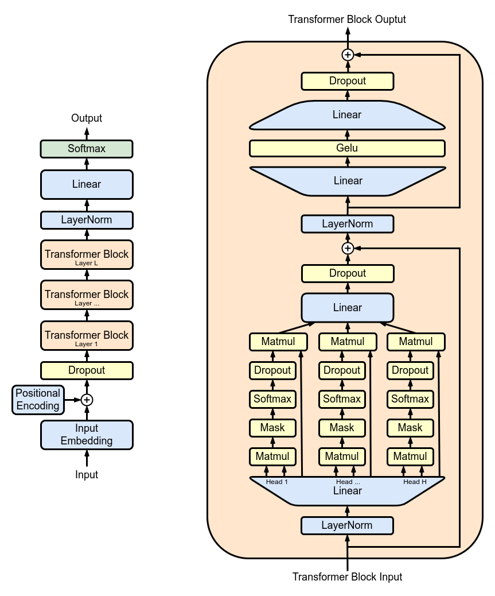
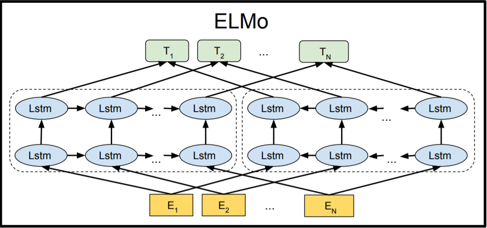

# NER Resume Pipeline Resume-Parsing Web App Solution 

## API - deployment
Models were containerized (Docker), set up as API (FastAPI) and deployed on Google Cloud Plattform.
Endpoints:  https://jzl-search-api-v7otpcjevq-lz.a.run.app/docs

# Job Boards - Deep Dive into AI creation workflow

From the AI perspective, our main goal was to create a machine learning model which was able to generate cover letters undistinguished from a human-written one. After reviewing different NLG approaches we have decided for the training already existing transformer model, as the most efficient approach.

The first training of the small 124-M parameters GPT-2 model with the dataset of collected cover letters gave us very impressive results (loss=0.19, avg=0.64, 1500 steps): the newly trained model was able to create the text on a very high qualitative level, but the content was not relevant to the candidate skills and job title. For the model training, we have adjusted gpt-2-simple framework from Max Woolf. 

To get more control over the model output we have decided also to add to the training dataset skills extracted from cover letters and job titles. To find this approach helped us the article from Ivan Lai. It was a challenge to find the most suitable model, which was able to extract correctly the skills from cover letters, but after some experiments with different NLP frameworks (BERT, TFIDF), we decided to use SpaCy Named Entity Recognition model (en\_core\_web\_sm) combined with EntityRuler for custom skills labeling.

The skills dataset we found in Microsoft repository on Github. The created NER (named entity recognition) framework helped us to add into the training dataset skills and job titles. The retrained GPT-2 based model was able to create a cover letter by prompting a set of skills, job title, or combination of both. In the results we were able to see that the generated text was relevant to the passed into the model information: We need to mention that the description of experiences, the name of the candidate as well as the recipient was created here by the model randomly. 

Our next step will be extending the controlled parameters by those options, but we expect that here might be implemented the same approach as with the skills.

In our results, we have seen that optimal results were achieved by using minimal numbers of skills as the prompt message – two or three, with a high probability those skills were recognized and implemented in the model text. Probably due to the small size of the training dataset the model was not capable of working with a bigger number of elements for proper prediction.

The collected learnings gave the model opportunity to ignore by the text generation those prompted skills which are completely uncommon for the specific job profile, so it was not possible to create a cover letter for a Data Scientist with mention of a car driving license as a skill, for example.

Another learning we have collected by the training is the fact that the used transformer model was able to recognize the weight of the specific skills via their count in the specific text. So it was also possible due to duplication of some skills in the prompt to increase their representation in the output text.

# Three Created AI-Models for Job Boards 

## 1. model:simple without labels and metadata

Based on gpt-2-simple library from Max Woolf - [https://minimaxir.com/2019/09/howto-gpt2/](https://minimaxir.com/2019/09/howto-gpt2/)

### Test finetuning - execution:

1. Upload notebook file to Google Colab
2. Set the runtime type as GPU
3. Execute all cells from top to bottom

## 2. model: with Title labels 
Model was trained based on cover letters text bodies with job titles and skills as additional metadata.

##  3. model: KWs (skills) - extraction
Based on SpyCy NEP with custom keywords matching (json - file with skills - attached). 
Extraction algorithm was used for job and cv analysis, as well for similarity matching. 

## API - deployment
Models were containerized (Docker), set up as API (FastAPI), and deployed on Google Cloud Platform.
Endpoints: [https://jzl-search-api-v7otpcjevq-lz.a.run.app/docs](https://jzl-search-api-v7otpcjevq-lz.a.run.app/docs)

Cover letter generation: [https://jzl-api-v7otpcjevq-lz.a.run.app/?length=500&temperature=0.7&prefix=](https://jzl-api-v7otpcjevq-lz.a.run.app/?length=500&temperature=0.7&prefix=)

(For customized letter creation, use the prefix variable in the format: **-Job Title-skill1, skill2, skill3**)

# Job Boards - AI - deep dive into creation workflow

From the AI perspective, our main goal was to create a machine learning model capable of generating cover letters undistinguished from a human-written one. After reviewing different NLG approaches, we have decided to train an existing transformer model, as it proved to be the most efficient approach.

The initial training of the small 124-M parameters GPT-2 model using a dataset of collected cover letters gave us impressive results (loss=0.19, avg=0.64, 1500 steps): the newly trained model was able to create text at a very high qualitative level, but the content was not relevant to the candidate's skills and job title. To address this, we adjusted the gpt-2-simple framework developed by Max Woolf. [1]

To gain more control over the model output, we also decided to add skills extracted from cover letters and job titles to the training dataset. An article by Ivan Lai [2] helped us find this approach.

Finding the most suitable model for correctly extracting skills from cover letters was a challenge. After experimenting with different NLP frameworks (BERT, TFIDF), we ultimately chose to use SpaCy's Named Entity Recognition model (en_core_web_sm) combined with EntityRuler for custom skills labeling. We obtained the skills dataset from the Microsoft repository on Github. [3]

Although the dataset we used had only around 2000 listed skills, the final model met our expectations, correctly identifying most of the candidate skills in the tested cover letters
